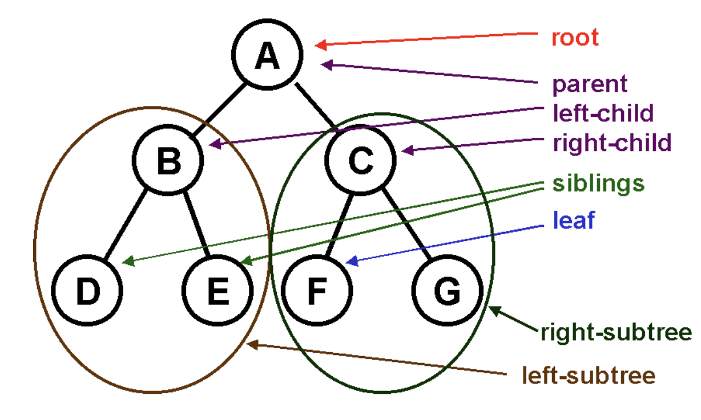
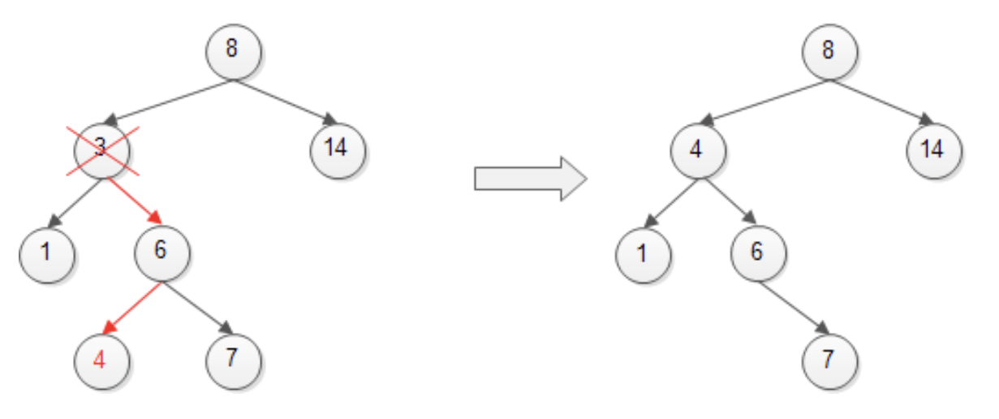
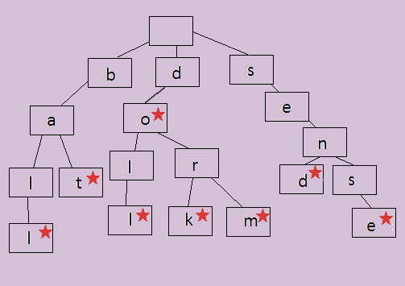
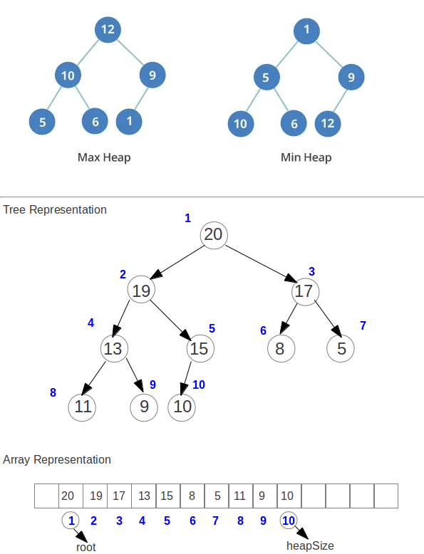

# Data Structures and Algorithms Notes

<hr>

<!-- @import "[TOC]" {cmd="toc" depthFrom=1 depthTo=6 orderedList=false} -->

<!-- code_chunk_output -->

- [Data Structures and Algorithms Notes](#data-structures-and-algorithms-notes)
  - [Stacks](#stacks)
  - [Sets](#sets)
  - [Queue](#queue)
  - [Binary Search Tree](#binary-search-tree)
    - [Binary Search Tree: Height & Traversal](#binary-search-tree-height-traversal)
        - [Breadth-First Search (BFS)](#breadth-first-search-bfs)
  - [Hash Table](#hash-table)
  - [Linked List](#linked-list)
  - [Trie](#trie)
  - [Heap](#heap)
  - [Graphs](#graphs)
        - [Breadth-First Search in a Graph](#breadth-first-search-in-a-graph)

<!-- /code_chunk_output -->

## Stacks
- Last in First out service
  - Book 4 would be the first to remove as it was the last one put onto the data structure
    - [ book 4 ]
    - [ book 3 ]
    - [ book 2 ]
    - [ book 1 ]
- Functions: push (to push elements to Stack), pop (to remove the top element off the Stack), peek (displaying top element of Stack), length (view how long the Stack is)

```
var Stack = function() {
    this.count = 0;
    this.storage = {};

                                // Adds a value onto the end of the stack

    this.push = function(value) {
        this.storage[this.count] = value;
        this.count++;
    }

                                // Removes and returns the value at the end of the stack

    this.pop = function() {
        if (this.count === 0) {
            return undefined;
        }

        this.count--;
        var result = this.storage[this.count];
        delete this.storage[this.count];
        return result;
    }

    this.size = function() {
        return this.count;
    }

                                // Returns the value at the end of the stack

    this.peek = function() {
        return this.storage[this.count-1];
    }
}

var myStack = new Stack();
```

## Sets

- Like an array except there are no duplicate items and the values are not in any particular order
- Typical use is to check for the presence of an item

```
function mySet() {

                                // the var collection will hold the set

    var collection = [];

                                // this method will check for the presence of an element and return true or false

    this.has = function(element) {
        return (collection.indexOf(element) !== -1);
    };
                                // this method will return all the values in the set

    this.values = function() {
        return collection;
    };

                                // this method will add an element to the set

    this.add = function(element) {
        if(!this.has(element)){
            collection.push(element);
            return true;
        }
        return false;
    };

                                // this method will remove an element from a set

    this.remove = function(element) {
        if(this.has(element)){
            index = collection.indexOf(element);
            collection.splice(index,1);
            return true;
        }
        return false;
    };

                                // this method will return the size of the collection

    this.size = function() {
        return collection.length;
    };

                                // this method will return the union of two sets

    this.union = function(otherSet) {
        var unionSet = new mySet();
        var firstSet = this.values();
        var secondSet = otherSet.values();
        firstSet.forEach(function(e){
            unionSet.add(e);
        });
        secondSet.forEach(function(e){
            unionSet.add(e);
        });
        return unionSet;
    };

                                // this method will return the intersection of two sets as a new set

    this.intersection = function(otherSet) {
        var intersectionSet = new mySet();
        var firstSet = this.values();
        firstSet.forEach(function(e){
            if(otherSet.has(e)){
                intersectionSet.add(e);
            }
        });
        return intersectionSet;
    };

                                // this method will return the difference of two sets as a new set

    this.difference = function(otherSet) {
        var differenceSet = new mySet();
        var firstSet = this.values();
        firstSet.forEach(function(e){
            if(!otherSet.has(e)){
                differenceSet.add(e);
            }
        });
        return differenceSet;
    };

                                // this method will test if the set is a subset of a different set

    this.subset = function(otherSet) {
        var firstSet = this.values();
        return firstSet.every(function(value) {
          return otherSet.has(value);
        });
    };
}
var setA = new mySet();
```

## Queue

- First in First out
- Example: waiting in like in store, first in line is the first to leave the line

```
function Queue () {
    collection = [];
    this.print = function() {
        console.log(collection);
    };
    this.enqueue = function(element) {
        collection.push(element);
    };
    this.dequeue = function() {
        return collection.shift();
    };
    this.front = function() {
        return collection[0];
    };
    this.size = function() {
        return collection.length;
    };
    this.isEmpty = function() {
        return (collection.length === 0);
    };
}

var q = new Queue();
q.enqueue('a');
q.enqueue('b');
q.enqueue('c');
q.print();
q.dequeue();
console.log(q.front());
q.print();


function PriorityQueue () {
    var collection = [];
    this.printCollection = function() {
      (console.log(collection));
    };
    this.enqueue = function(element){
        if (this.isEmpty()){
            collection.push(element);
        } else {
            var added = false;
            for (var i=0; i<collection.length; i++){
                 if (element[1] < collection[i][1]){ //checking priorities
                    collection.splice(i,0,element);
                    added = true;
                    break;
                }
            }
            if (!added){
                collection.push(element);
            }
        }
    };
    this.dequeue = function() {
        var value = collection.shift();
        return value[0];
    };
    this.front = function() {
        return collection[0];
    };
    this.size = function() {
        return collection.length;
    };
    this.isEmpty = function() {
        return (collection.length === 0);
    };
}

var pq = new PriorityQueue();
```

## Binary Search Tree

- All Data points on a tree are called Nodes
- The origin point or first point in the tree is called the Root Node
- "Leaf" Nodes are Nodes that have no children
- "Binary" Tree can only have two nodes stemming from a parent
- Binary Search trees are ordered
  - the Left child is equal to or less than the parent node
  - the Right child is equal to or greater than the parent node

```
class Node {
  constructor(data, left = null, right = null) {
    this.data = data;
    this.left = left;
    this.right = right;
  }
}

class BST {
  constructor() {
    this.root = null;
  }
  add(data) {
    const node = this.root;
    if (node === null) {
      this.root = new Node(data);
      return;
    } else {
      const searchTree = function(node) {
        if (data < node.data) {
          if (node.left === null) {
            node.left = new Node(data);
            return;
          } else if (node.left !== null) {
            return searchTree(node.left);
          }
        } else if (data > node.data) {
          if (node.right === null) {
            node.right = new Node(data);
            return;
          } else if (node.right !== null) {
            return searchTree(node.right);
          }
        } else {
          return null;
        }
      };
      return searchTree(node);
    }
  }
  findMin() {
    let current = this.root;
    while (current.left !== null) {
      current = current.left;
    }
    return current.data;
  }
  findMax() {
    let current = this.root;
    while (current.right !== null) {
      current = current.right;
    }
    return current.data;
  }
  find(data) {
    let current = this.root;
    while (current.data !== data) {
      if (data < current.data) {
        current = current.left;
      } else {
        current = current.right;
      }
      if (current === null) {
        return null;
      }
    }
    return current;
  }
  isPresent(data) {
    let current = this.root;
    while (current) {
      if (data === current.data) {
        return true;
      }
      if (data < current.data) {
        current = current.left;
      } else {
        current = current.right;
      }
    }
    return false;
  }
  remove(data) {
    const removeNode = function(node, data) {
      if (node == null) {
        return null;
      }
      if (data == node.data) {
                                    // node has no children
        if (node.left == null && node.right == null) {
          return null;
        }
                                    // node has no left child
        if (node.left == null) {
          return node.right;
        }
                                    // node has no right child
        if (node.right == null) {
          return node.left;
        }
                                    // node has two children
        var tempNode = node.right;
        while (tempNode.left !== null) {
          tempNode = tempNode.left;
        }
        node.data = tempNode.data;
        node.right = removeNode(node.right, tempNode.data);
        return node;
      } else if (data < node.data) {
        node.left = removeNode(node.left, data);
        return node;
      } else {
        node.right = removeNode(node.right, data);
        return node;
      }
    }
    this.root = removeNode(this.root, data);
  }
  isBalanced() {
    return (this.findMinHeight() >= this.findMaxHeight() - 1)
  }
  findMinHeight(node = this.root) {
      if (node == null) {
          return -1;
      };
      let left = this.findMinHeight(node.left);
      let right = this.findMinHeight(node.right);
      if (left < right) {
          return left + 1;
      } else {
          return right + 1;
      };
  }
  findMaxHeight(node = this.root) {
      if (node == null) {
          return -1;
      };
      let left = this.findMaxHeight(node.left);
      let right = this.findMaxHeight(node.right);
      if (left > right) {
          return left + 1;
      } else {
          return right + 1;
      };
  }
  inOrder() {
    if (this.root == null) {
      return null;
    } else {
      var result = new Array();
      function traverseInOrder(node) {
        node.left && traverseInOrder(node.left);
        result.push(node.data);
        node.right && traverseInOrder(node.right);
      }
      traverseInOrder(this.root);
      return result;
    };
  }
  preOrder() {
    if (this.root == null) {
      return null;
    } else {
      var result = new Array();
      function traversePreOrder(node) {
        result.push(node.data);
        node.left && traversePreOrder(node.left);
        node.right && traversePreOrder(node.right);
      };
      traversePreOrder(this.root);
      return result;
    };
  }
  postOrder() {
    if (this.root == null) {
      return null;
    } else {
      var result = new Array();
      function traversePostOrder(node) {
        node.left && traversePostOrder(node.left);
        node.right && traversePostOrder(node.right);
        result.push(node.data);
      };
      traversePostOrder(this.root);
      return result;
    }
  }

  levelOrder() {
      let result = [];
      let Q = [];
      if (this.root != null) {
          Q.push(this.root);
          while(Q.length > 0) {
              let node = Q.shift();
              result.push(node.data);
              if (node.left != null) {
                  Q.push(node.left);
              };
              if (node.right != null) {
                  Q.push(node.right);
              };
          };
          return result;
      } else {
          return null;
      };
  };
}


const bst = new BST();
```



### Binary Search Tree: Height & Traversal

- Height represents the distance from the root node to any given leaf node
  - By layer, values differ at most by 1
  - Reference code above ^ (from Binary Search Tree)
  - Searching through a tree is much more efficient when the tree is Balanced
    - Tree is balanced essentially if the leafs are even on a given layer, i.e: there is a lesser and greater leaf for each parent on a given level
- Dissecting a Binary Search tree layer by layer by starting at the tree root and exploring all the nodes at the present depth prior to moving on to the nodes at the next depth level is called <b>Breadth-First Search</b>




##### Breadth-First Search (BFS)

- Fundamental searhc algorithm for exploring nodes and edges of a graph
- Runs in 0(V+E) [v = vertices, e = edges]
- BFS is particularly useful for finding the <b>shortest path on unweighted graphs</b>
    - Starts at a node, views all of that nodes neighbors before moving onto the next layer of nodes
    - Maintains a queue of which node it should visit next 

## Hash Table

- Very efficient: average time complexity is O(1)
- Basically runs keys through a hash function so that it links to a number (hash)
- In Javascript you do not have to code out the logic for a hash table (object) but its nice to see how it works under the hood.

```
var hash = (string, max) => {
  var hash = 0;
  for (var i = 0; i < string.length; i++) {
    hash += string.charCodeAt(i);
  }
  return hash % max;
};

let HashTable = function() {

  let storage = [];
  const storageLimit = 14;
  
  this.print = function() {
    console.log(storage)
  }

  this.add = function(key, value) {
    var index = hash(key, storageLimit);
    if (storage[index] === undefined) {
      storage[index] = [
        [key, value]
      ];
    } else {
      var inserted = false;
      for (var i = 0; i < storage[index].length; i++) {
        if (storage[index][i][0] === key) {
          storage[index][i][1] = value;
          inserted = true;
        }
      }
      if (inserted === false) {
        storage[index].push([key, value]);
      }
    }
  };

  this.remove = function(key) {
    var index = hash(key, storageLimit);
    if (storage[index].length === 1 && storage[index][0][0] === key) {
      delete storage[index];
    } else {
      for (var i = 0; i < storage[index].length; i++) {
        if (storage[index][i][0] === key) {
          delete storage[index][i];
        }
      }
    }
  };

  this.lookup = function(key) {
    var index = hash(key, storageLimit);
    if (storage[index] === undefined) {
      return undefined;
    } else {
      for (var i = 0; i < storage[index].length; i++) {
        if (storage[index][i][0] === key) {
          return storage[index][i][1];
        }
      }
    }
  };

};

```

## Linked List

- Common data structure where elements are stored in a node with 2 key pieces of information:
  - The element itself 
  - A reference to the next node
- Linked Lists are:
  - Efficient Insertions and Deletions
  - No random access to elements ( like arrays )
  - No waste of memory
  - Sequential access is slow 
    - Elements are not in contiguous memory locations

``` 
function LinkedList() { 
  var length = 0; 
  var head = null; 

  var Node = function(element){
    this.element = element; 
    this.next = null; 
  }; 

  this.size = function(){
    return length;
  };

  this.head = function(){
    return head;
  };

  this.add = function(element){
    var node = new Node(element);
    if(head === null){
        head = node;
    } else {
        var currentNode = head;

        while(currentNode.next){
            currentNode  = currentNode.next;
        }

        currentNode.next = node;
    }

    length++;
  }; 

  this.remove = function(element){
    var currentNode = head;
    var previousNode;
    if(currentNode.element === element){
        head = currentNode.next;
    } else {
        while(currentNode.element !== element) {
            previousNode = currentNode;
            currentNode = currentNode.next;
        }

        previousNode.next = currentNode.next;
    }

    length --;
  };
  
  this.isEmpty = function() {
    return length === 0;
  };

  this.indexOf = function(element) {
    var currentNode = head;
    var index = -1;

    while(currentNode){
        index++;
        if(currentNode.element === element){
            return index;
        }
        currentNode = currentNode.next;
    }

    return -1;
  };

  this.elementAt = function(index) {
    var currentNode = head;
    var count = 0;
    while (count < index){
        count ++;
        currentNode = currentNode.next
    }
    return currentNode.element;
  };
  
  
  this.addAt = function(index, element){
    var node = new Node(element);

    var currentNode = head;
    var previousNode;
    var currentIndex = 0;

    if(index > length){
        return false;
    }

    if(index === 0){
        node.next = currentNode;
        head = node;
    } else {
        while(currentIndex < index){
            currentIndex++;
            previousNode = currentNode;
            currentNode = currentNode.next;
        }
        node.next = currentNode;
        previousNode.next = node;
    }
    length++;
  }
  
  this.removeAt = function(index) {
    var currentNode = head;
    var previousNode;
    var currentIndex = 0;
    if (index < 0 || index >= length){
        return null
    }
    if(index === 0){
        head = currentNode.next;
    } else {
        while(currentIndex < index) {
            currentIndex ++;
            previousNode = currentNode;
            currentNode = currentNode.next;
        }
        previousNode.next = currentNode.next
    }
    length--;
    return currentNode.element;
  }

} 
```

## Trie

- Sometimes called a prefix tree
- Special type of tree used to store associatve data structures
- Trie stores data in steps, each step is a node in the Trie

```
let Node = function() {
	this.keys = new Map();
	this.end = false;
	this.setEnd = function() {
		this.end = true;
	};
	this.isEnd = function() {
		return this.end;
	};
};

let Trie = function() {

	this.root = new Node();

	this.add = function(input, node = this.root) {
		if (input.length == 0) {
			node.setEnd();
			return;
		} else if (!node.keys.has(input[0])) {
			node.keys.set(input[0], new Node());
			return this.add(input.substr(1), node.keys.get(input[0]));
		} else {
			return this.add(input.substr(1), node.keys.get(input[0]));
		};
	};

	this.isWord = function(word) {
		let node = this.root;
		while (word.length > 1) {
			if (!node.keys.has(word[0])) {
				return false;
			} else {
				node = node.keys.get(word[0]);
				word = word.substr(1);
			};
		};
		return (node.keys.has(word) && node.keys.get(word).isEnd()) ? 
      true : false;
	};

	this.print = function() {
		let words = new Array();
		let search = function(node, string) {
			if (node.keys.size != 0) {
				for (let letter of node.keys.keys()) {
					search(node.keys.get(letter), string.concat(letter));
				};
				if (node.isEnd()) {
					words.push(string);
				};
			} else {
				string.length > 0 ? words.push(string) : undefined;
				return;
			};
		};
		search(this.root, new String());
		return words.length > 0 ? words : mo;
	};

};
```



## Heap 

- Some similarities to a binary search tree except the order is different
- Each node has at most 2 child nodes
  - <b>Max Heap</b>: All parent nodes are equal than or greater than the child nodes 
  - <b>Min Heap</b>: All parent nodes are equal than or smaller than the child nodes 
- Heaps can be, and are often, represented as arrays
- Heaps have no index 0

```
let MinHeap = function() {
	
	let heap = [null];
	
	this.insert = function(num) {
		heap.push(num);
		if (heap.length > 2) {
			let idx = heap.length - 1;
			while (heap[idx] < heap[Math.floor(idx/2)]) {
				if (idx >= 1) {
					[heap[Math.floor(idx/2)], heap[idx]] = [heap[idx], heap[Math.floor(idx/2)]];
					if (Math.floor(idx/2) > 1) {
						idx = Math.floor(idx/2);
					} else {
						break;
					};
				};
			};
		};
	};
	
	this.remove = function() {
		let smallest = heap[1];
		if (heap.length > 2) {
			heap[1] = heap[heap.length - 1];
			heap.splice(heap.length - 1);
			if (heap.length == 3) {
				if (heap[1] > heap[2]) {
					[heap[1], heap[2]] = [heap[2], heap[1]];
				};
				return smallest;
			};
			let i = 1;
			let left = 2 * i;
			let right = 2 * i + 1;
			while (heap[i] >= heap[left] || heap[i] >= heap[right]) {
				if (heap[left] < heap[right]) {
					[heap[i], heap[left]] = [heap[left], heap[i]];
					i = 2 * i
				} else {
					[heap[i], heap[right]] = [heap[right], heap[i]];
					i = 2 * i + 1;
				};
				left = 2 * i;
				right = 2 * i + 1;
				if (heap[left] == undefined || heap[right] == undefined) {
					break;
				};
			};
		} else if (heap.length == 2) {
			heap.splice(1, 1);
		} else {
			return null;
		};
		return smallest;
	};
  
	this.sort = function() {
		let result = new Array();
		while (heap.length > 1) {
			result.push(this.remove());
		};
		return result;
	};

};

let MaxHeap = function() {
	
	let heap = [null];
	
	this.print = () => heap;

	this.insert = function(num) {
		heap.push(num);
		if (heap.length > 2) {
			let idx = heap.length - 1;
			while (heap[idx] > heap[Math.floor(idx/2)]) {
				if (idx >= 1) {
					[heap[Math.floor(idx/2)], heap[idx]] = [heap[idx], heap[Math.floor(idx/2)]];
					if (Math.floor(idx/2) > 1) {
						idx = Math.floor(idx/2);
					} else {
						break;
					};
				};
			};
		};
	};
	
	this.remove = function() {
		let smallest = heap[1];
		if (heap.length > 2) {
			heap[1] = heap[heap.length - 1];
			heap.splice(heap.length - 1);
			if (heap.length == 3) {
				if (heap[1] < heap[2]) {
					[heap[1], heap[2]] = [heap[2], heap[1]];
				};
				return smallest;
			};
			let i = 1;
			let left = 2 * i;
			let right = 2 * i + 1;
			while (heap[i] <= heap[left] || heap[i] <= heap[right]) {
				if (heap[left] > heap[right]) {
					[heap[i], heap[left]] = [heap[left], heap[i]];
					i = 2 * i
				} else {
					[heap[i], heap[right]] = [heap[right], heap[i]];
					i = 2 * i + 1;
				};
				left = 2 * i;
				right = 2 * i + 1;
				if (heap[left] == undefined || heap[right] == undefined) {
					break;
				};
			};
		} else if (heap.length == 2) {
			heap.splice(1, 1);
		} else {
			return null;
		};
		return smallest;
	};

};
```



## Graphs

- Data in graphs are called nodes / vertices
- The connections between the nodes are called edges
- Example of graph: Social Media Network
- <b>Directed Graphs</b>: graphs that do have directions associated with its edges 
  - Example: The internet and web page links, nodes are webpages, edges are links to other pages
- <b>Undirected Graphs</b>: graphs that have no directs associated to its edges
  - Example: social network, nodes are people, edges are friendships


##### Breadth-First Search in a Graph
```
function bfs(graph, root) {
  var nodesLen = {};
  
  for (var i = 0; i < graph.length; i++) {
    nodesLen[i] = Infinity;
  }
  nodesLen[root] = 0; 
  
  var queue = [root]; 
  var current; 

  while (queue.length != 0) {
    current = queue.shift();
    
    var curConnected = graph[current];
    var neighborIdx = []; 
    var idx = curConnected.indexOf(1); 
    while (idx != -1) {
      neighborIdx.push(idx); 
      idx = curConnected.indexOf(1, idx + 1); 
    }
    
    for (var j = 0; j < neighborIdx.length; j++) {
      if (nodesLen[neighborIdx[j]] == Infinity) {
        nodesLen[neighborIdx[j]] = nodesLen[current] + 1;
        queue.push(neighborIdx[j]); 
      }
    }
  }
  return nodesLen;
};
```